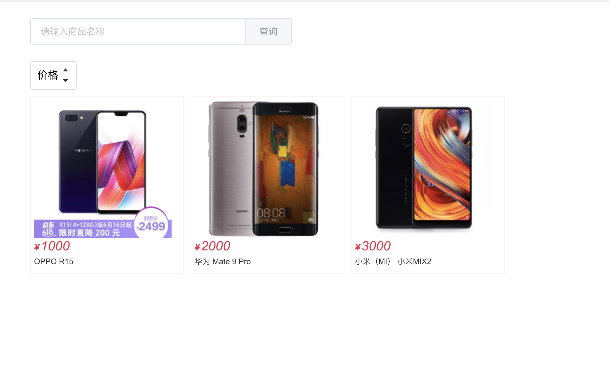

## 商品页(五)

新建 客户端  client/page/home/home.vue
```
<template>
  <div class="home-page">
    <div class="home-search">
      <el-input placeholder="请输入商品名称" v-model="text" class="input-with-select">
        <el-button
          slot="append"
          type="primary"
          @click="query">
          查询
        </el-button>
      </el-input>
    </div>
    <div class="home-select" @click="handleSort">
      <span class="home-select-text">价格</span>
      <span class="home-select-caret">
        <div class="home-icon-caret" :class="{active: sort === 'asc'}">
          <span class="el-icon-caret-top" ></span>
        </div>
        <div class="home-icon-caret" :class="{active: sort === 'desc'}">
          <span class="el-icon-caret-bottom" ></span>
        </div>
      </span>
    </div>
    <div class="goods-wrapper">
      <div class="goods-item-wrapper"
        v-for="good in goods"
        :key="good.id">
        <div class="goods-item">
          
          <em :title="good.price" class="goods-price">
            <b>¥</b>{{good.price}}
          </em>
          <span class="goods-name">{{good.name}}</span>
        </div>
      </div>
    </div>
  </div>
</template>

<script type="text/ecmascript-6">
import { Button, Input, Message } from 'element-ui'

const COMPONENTS_NAME = 'home-page'

export default {
  name: COMPONENTS_NAME,
  data () {
    return {
      text: '',
      sort: '',
      goods: []
    }
  },
  methods: {
    handleSort () {
      if (this.sort === 'desc') {
        this.sort = 'asc'
      } else {
        this.sort = 'desc'
      }
      this.query()
    },
    query () {
        Message({
          message: '查询！',
          type: 'success'
        })
    }
  },
  components: {
    [Button.name]: Button,
    [Input.name]: Input
  }
}
</script>

<style scoped lang="stylus" rel="stylesheet/stylus">
@import "~common/css/variable"
@import "~common/css/mixin"

.home-page
  margin 0 auto
  padding 0 10px
  width 980px
  height 100%
  .home-search
    padding 25px 0px
    width 400px
  .goods-wrapper
    margin-right -10px
    width 100%
    font-size 0
  .goods-item-wrapper
    width 25%
    inline-block-top()
  .goods-item
    margin 10px 10px 10px 0
    padding 5px
    border 1px solid #f5f5f5
    cursor pointer
    box-sizing border-box
    &:hover
      padding 2px
      border 4px solid #ff0036
      transition border-color .2s ease-in
    .goods-image
      width 210px
      height 210px
    .goods-price
      display block
      height 24px
      line-height 24px
      font-family arial
      font-weight 400
      font-size 20px
      color #ff0036
      b
        margin-right 2px
        font-weight 700
        font-size $font-size-md
    .goods-name
      display block
      height 25px
      line-height 25px
      color $color-text
      font-size $font-size-sm
  .home-select
    padding 5px 10px
    height 32px
    line-height 32px
    border 1px solid #dcdcdc
    border-radius 5px
    cursor pointer
    user-select none
    inline-block-top()
    &:hover
      background-color $color-mark
    .home-select-text
      margin-right 5px
    .home-select-caret
      position relative
      inline-block-top()
    .home-icon-caret
      height 16px
      line-height 16px
      color $color-text
      font-size $font-size-sm
      &.active
        color $color-theme
</style>
```
就是一个简单查询页面，接下来新增商品接口

##### 商品接口
服务端： 新增 router/gooods.js
```
import Sequelize from 'sequelize'
import {
  Controller,
  Get,
  Auth
} from '../decorator/router'
import Models from '../models'
import { ERR_SUCCESS } from '../utils/http-status'

@Controller('/api/goods')
export default class userRouter {
  @Get('/getGoods')
  @Auth
  async getGoods(ctx, next) {
    const { name, sort } = ctx.query
    let order = []
    if (sort === 'asc') {
      order.push(['price', 'ASC'])
    } else if (sort === 'desc') {
      order.push(['price', 'DESC'])
    }
    const user = await Models.goods.findAll({
      where: {
        name: { [Sequelize.Op.like]: `%${name}%` }
      },
      order: order
    })
    ctx.body = {
      code: ERR_SUCCESS,
      message: 'success',
      data: user
    }
  }
}
```
创建一个 /api/goods/getGoods 的接口， 并且有token校验和支持商品名称模糊查询，排序的get请求。
(重启服务器！)

接口以及写好了，接下写客户端通过接口查询商品

客户端： 新增 api/goods.js
```
import axios from 'axios'

// 获取商品
export function getGoods ({ name, sort }) {
  const url = '/api/goods/getGoods'
  return axios.get(url, {
    params: {
      name,
      sort
    }
  }).then((res) => {
    return Promise.resolve(res.data)
  })
}
```

客户端：修改 home.vue ， 引入接口的函数
```
<template>
  <div class="home-page">
    <div class="home-search">
      <el-input placeholder="请输入商品名称" v-model="text" class="input-with-select">
        <el-button
          slot="append"
          type="primary"
          @click="query">
          查询
        </el-button>
      </el-input>
    </div>
    <div class="home-select" @click="handleSort">
      <span class="home-select-text">价格</span>
      <span class="home-select-caret">
        <div class="home-icon-caret" :class="{active: sort === 'asc'}">
          <span class="el-icon-caret-top" ></span>
        </div>
        <div class="home-icon-caret" :class="{active: sort === 'desc'}">
          <span class="el-icon-caret-bottom" ></span>
        </div>
      </span>
    </div>
    <div class="goods-wrapper">
      <div class="goods-item-wrapper"
        v-for="good in goods"
        :key="good.id">
        <div class="goods-item">
          
          <em :title="good.price" class="goods-price">
            <b>¥</b>{{good.price}}
          </em>
          <span class="goods-name">{{good.name}}</span>
        </div>
      </div>
    </div>
  </div>
</template>

<script type="text/ecmascript-6">
import { Button, Input, Message } from 'element-ui'
import { getGoods } from 'api/goods'
import { ERR_SUCCESS } from 'api/http-status'

const COMPONENTS_NAME = 'home-page'

export default {
  name: COMPONENTS_NAME,
  data () {
    return {
      text: '',
      sort: '',
      goods: []
    }
  },
  methods: {
    handleSort () {
      if (this.sort === 'desc') {
        this.sort = 'asc'
      } else {
        this.sort = 'desc'
      }
      this.query()
    },
    query () {
      const { text, sort } = this
      getGoods({ name: text, sort }).then(res => {
        if (res.code === ERR_SUCCESS) {
          this.goods = res.data
        } else {
          Message.error(res.message)
        }
      })
    }
  },
  components: {
    [Button.name]: Button,
    [Input.name]: Input
  }
}
</script>

<style scoped lang="stylus" rel="stylesheet/stylus">
@import "~common/css/variable"
@import "~common/css/mixin"

.home-page
  margin 0 auto
  padding 0 10px
  width 980px
  height 100%
  .home-search
    padding 25px 0px
    width 400px
  .goods-wrapper
    margin-right -10px
    width 100%
    font-size 0
  .goods-item-wrapper
    width 25%
    inline-block-top()
  .goods-item
    margin 10px 10px 10px 0
    padding 5px
    border 1px solid #f5f5f5
    cursor pointer
    box-sizing border-box
    &:hover
      padding 2px
      border 4px solid #ff0036
      transition border-color .2s ease-in
    .goods-image
      width 210px
      height 210px
    .goods-price
      display block
      height 24px
      line-height 24px
      font-family arial
      font-weight 400
      font-size 20px
      color #ff0036
      b
        margin-right 2px
        font-weight 700
        font-size $font-size-md
    .goods-name
      display block
      height 25px
      line-height 25px
      color $color-text
      font-size $font-size-sm
  .home-select
    padding 5px 10px
    height 32px
    line-height 32px
    border 1px solid #dcdcdc
    border-radius 5px
    cursor pointer
    user-select none
    inline-block-top()
    &:hover
      background-color $color-mark
    .home-select-text
      margin-right 5px
    .home-select-caret
      position relative
      inline-block-top()
    .home-icon-caret
      height 16px
      line-height 16px
      color $color-text
      font-size $font-size-sm
      &.active
        color $color-theme
</style>

```

打开浏览器 http://localhost:8080/home

点击查询按钮, 能看到查询出商品



输入商品名称/价格排序，能看到数据发生变化！