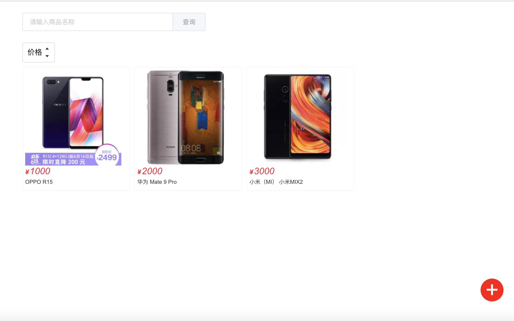
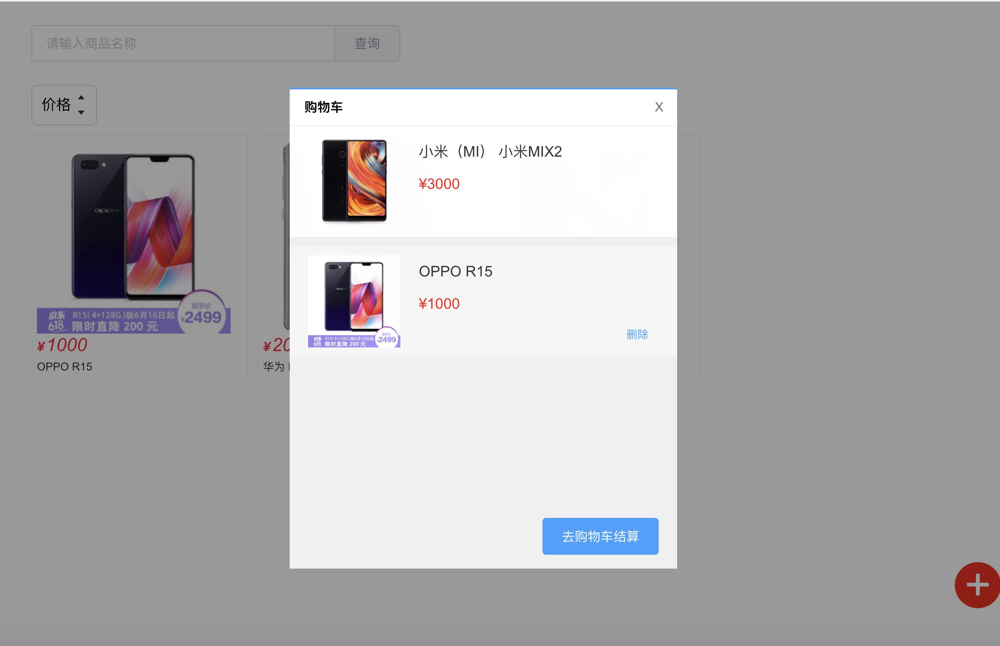
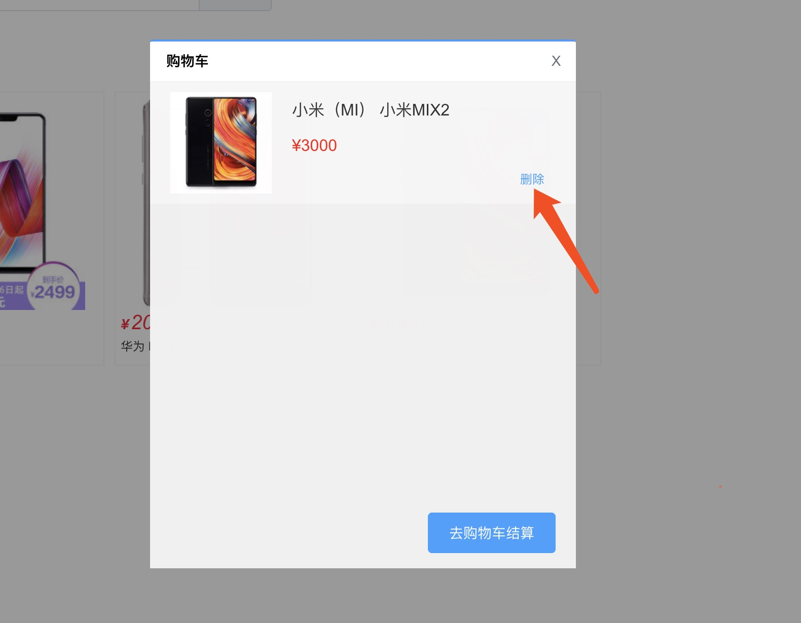

## 购物车收藏(五)
接下来，我们要写收藏商品的组件，并且保存到数据库

element-ui有个dialog，但我们尝试自己实现一个dialog

dialog 无非就是div包裹插槽，弹窗的动画

(本文不打算写成插入body下的弹窗，不解决深层CSS层级的弹窗）

客户端： 新增 common/js/dom.js
```
export function hasClass (el, className) {
  return el.classList.contains(className)
}
export function addClass (el, className) {
  el.classList.add(className)
}
export function removeClass (el, className) {
  el.classList.remove(className)
}

```
#### 弹窗
客户端： 新增 base/base-dialog/base-dialog.vue
```
<template>
  <transition @beforeEnter="beforeEnter" @leave="leave">
    <div class="base-dialog-wrapper">
      <div class="base-dialog-mark"></div>
      <div class="base-dialog">
        <div class="base-dialog-conter">
          <slot name="slot">
            <div class="dialog-header">
              <h3>{{title}}</h3>
              <span class="dialog-close" @click="dialogClose">
                X
              </span>
            </div>
          </slot>
          <slot></slot>
        </div>
      </div>
    </div>
  </transition>
</template>

<script type="text/ecmascript-6">
import {addClass, removeClass} from 'common/js/dom'

const COMPONENTS_NAME = 'base-dialog'
const ANIMATION_ACTIVE = 'active'
const ANIMATION_UNACTIVE = 'unactive'

export default {
  name: COMPONENTS_NAME,
  props: {
    title: {
      type: String,
      defalut: ''
    },
    hasTitle: {
      type: Boolean,
      defalut: true
    }
  },
  methods: {
    dialogClose () {
      this.$emit('close')
    },
    beforeEnter (el) {
      const mark = el.querySelector('.base-dialog-mark')
      const conter = el.querySelector('.base-dialog-conter')
      mark && addClass(mark, ANIMATION_ACTIVE)
      conter && addClass(conter, ANIMATION_ACTIVE)
    },
    leave (el, done) {
      const mark = el.querySelector('.base-dialog-mark')
      const conter = el.querySelector('.base-dialog-conter')
      if (mark) {
        removeClass(mark, ANIMATION_ACTIVE)
        addClass(mark, ANIMATION_UNACTIVE)
      }
      if (conter) {
        removeClass(conter, ANIMATION_ACTIVE)
        addClass(conter, ANIMATION_UNACTIVE)
      }
      setTimeout(() => {
        done()
      }, 300)
    }
  }
}
</script>

<style scoped lang="stylus" rel="stylesheet/stylus">
@import "~common/css/variable"
@import "~common/css/mixin"

.base-dialog-wrapper
  position fixed
  top 0
  left 0
  width 100%
  height 100%
  z-index $zIndex-dialog
  .base-dialog-mark
    position fixed
    top 0
    left 0
    right 0
    bottom 0
    z-index $zIndex-mark
    background-color rgba(0, 0, 0, 0.4)
    &.active
      animation amFadeIn .3s linear
      animation-fill-mode both
    &.unactive
      animation amFadeOut .3s linear
      animation-fill-mode both
  .base-dialog
    position fixed
    top 50%
    left 50%
    transform translate(-50%, -50%)
    z-index $zIndex-dialog
    &.active
      animation BombIn .3s linear
      animation-fill-mode both
    &.unactive
      animation BombOut .3s linear
      animation-fill-mode both
  .base-dialog-conter
    min-width 200px
    min-height 150px
    background-color $color-background
    border-top 2px solid $color-theme
    border-radius 3px
    &.active
      animation fadeInDown .3s linear
      animation-fill-mode both
    &.unactive
      animation fadeOutDown .3s linear
      animation-fill-mode both
  .dialog-header
    width 100%
    height 39px
    line-height 39px
    border-bottom 1px solid #f2f2f5
    cursor move
    h3
      margin-right 39px
      padding 0 0 0 16px
      font-size $font-size-md
      font-weight 700
      inline-block-top()
    .dialog-close
      float right
      width 39px
      height 39px
      line-height 39px
      font-size $font-size-md
      color #696e78
      cursor pointer
      text-align center
      background transparent
      transition background-color .3s
      inline-block-top()
      &:hover
        background-color $color-mark
@keyframes amFadeIn
  0%
    opacity 0
  100%
    opacity 1
@keyframes amFadeOut
  0%
    opacity 1
  100%
    opacity 0

@keyframes fadeInDown
  0%
    opacity 0
    transform translateY(-20px)
  100%
    opacity 1
    transform translateY(0)
@keyframes fadeOutDown
  0%
    opacity 1
    transform translateY(0)
  100%
    opacity 0
    transform translateY(20px)
</style>

```
#### 购物车组件
写好dialog，新增 components/the-cart/the-cart.vue
```
<template>
  <base-dialog title="购物车" @close="goBack">
    <div class="cart-wrapper">
      <div class="cart-content">
        <div class="cart-content-scroll">
          <div class="cart-item"
            v-for="(cart, index) in cartList"
            :key="cart.id">
            <div class="cart-image">
              
            </div>
            <div class="cart-info">
              <p class="cart-text">{{cart.name}}</p>
              <span class="cart-price">¥{{cart.price}}</span>
            </div>
            <el-button
              class="cart-button"
              type="text"
              size="mini"
              @click="_deleteCart(cart, index)">删除</el-button>
          </div>
        </div>
      </div>
      <div class="cart-button-wrapper">
        <div class="cart-button">
          <el-button type="primary" @click="pay()">
            去购物车结算
          </el-button>
        </div>
      </div>
    </div>
  </base-dialog>
</template>

<script type="text/ecmascript-6">
import { mapGetters } from 'vuex'
import { Button, Message } from 'element-ui'
import BaseDialog from 'base/base-dialog/base-dialog'
import { ERR_SUCCESS } from 'api/http-status'
import { getCart, deleteCart } from 'api/cart'

const COMPONENTS_NAME = 'the-cart'

export default {
  name: COMPONENTS_NAME,
  data () {
    return {
      cartList: []
    }
  },
  created () {
    this._getCart()
  },
  computed: {
    ...mapGetters(['user'])
  },
  methods: {
    goBack () {
      this.$router.go(-1)
    },
    _deleteCart (item, index) {
      const { id } = item
      deleteCart({ id }).then(res => {
        if (res.code === ERR_SUCCESS) {
          this.cartList.splice(index, 1)
          Message({
            message: '删除成功！',
            type: 'success'
          })
        } else {
          Message.error(res.message)
        }
      })
    },
    pay () {
      Message({
        message: '结算成功！',
        type: 'success'
      })
    },
    _getCart () {
      const { id } = this.user
      getCart({ userid: id }).then(res => {
        if (res.code === ERR_SUCCESS) {
          this.cartList = res.data
        } else {
          Message.error(res.message)
        }
      })
    }
  },
  components: {
    [Button.name]: Button,
    [BaseDialog.name]: BaseDialog
  }
}
</script>

<style scoped lang="stylus" rel="stylesheet/stylus">
@import "~common/css/variable"
@import "~common/css/mixin"

.cart-wrapper
  position relative
  width 420px
  height 480px
  .cart-content
    position absolute
    top 0px
    left  0px
    bottom 70px
    width 100%
    overflow hidden
    .cart-content-scroll
      width 100%
      height 100%
      overflow-y auto
      background-color $color-mark
  .cart-button-wrapper
    position absolute
    left  0px
    bottom 0px
    width 100%
    height 70px
    line-height 70px
    text-align right
    background-color $color-mark
  .cart-button
    margin-right 20px
    inline-block-top()

.cart-item
  position relative
  margin-bottom 10px
  padding 10px 20px
  background-color $color-background
  cursor pointer
  &:hover
    background-color rgba(255,255,255,.4)
    .cart-button
      display block
  .cart-image
    float left
    width 100px
    height 100px
    img
      width 100px
      height 100px
  .cart-info
    margin-left 100px
    padding-left 20px
    height 100px
    line-height 35px
    .cart-text
      color #333
   .cart-price
      color red
  .cart-button
    display none
    position absolute
    right 10px
    bottom 10px
</style>

```
### 购物车的接口调用
新增购物车的接口 api/cart.js
```
import axios from 'axios'

// 获取购物车的商品信息
export function getCart ({ userid }) {
  const url = '/api/cart/getCart'
  return axios.get(url, {
    params: {
      userid
    }
  }).then((res) => {
    return Promise.resolve(res.data)
  })
}

// 添加商品到购物车
export function addCart ({ userid, goodsid }) {
  const url = '/api/cart/addCart'
  return axios.post(url, {
    userid, goodsid
  }).then((res) => {
    return Promise.resolve(res.data)
  })
}

// 删除购物车的商品信息
export function deleteCart ({ id }) {
  const url = '/api/cart/deleteCart'
  return axios.post(url, {
    id
  }).then((res) => {
    return Promise.resolve(res.data)
  })
}
```

#### 首页，购物车的入口：
也修改home.vue，支持收藏商品到购物车
```
<template>
  <div class="home-page">
    <div class="home-search">
      <el-input placeholder="请输入商品名称" v-model="text" class="input-with-select">
        <el-button
          slot="append"
          type="primary"
          @click="query">
          查询
        </el-button>
      </el-input>
    </div>
    <div class="home-select" @click="handleSort">
      <span class="home-select-text">价格</span>
      <span class="home-select-caret">
        <div class="home-icon-caret" :class="{active: sort === 'asc'}">
          <span class="el-icon-caret-top" ></span>
        </div>
        <div class="home-icon-caret" :class="{active: sort === 'desc'}">
          <span class="el-icon-caret-bottom" ></span>
        </div>
      </span>
    </div>
    <div class="goods-wrapper">
      <div class="goods-item-wrapper"
        v-for="good in goods"
        :key="good.id">
        <div class="goods-item" @click="_addCart(good)">
          
          <em :title="good.price" class="goods-price">
            <b>¥</b>{{good.price}}
          </em>
          <span class="goods-name">{{good.name}}</span>
        </div>
      </div>
    </div>
    <div class="cart-tip" @click="cartLink">+</div>
    <router-view></router-view>
  </div>
</template>

<script type="text/ecmascript-6">
import { mapGetters } from 'vuex'
import { Button, Input, Message } from 'element-ui'
import { getGoods } from 'api/goods'
import { ERR_SUCCESS } from 'api/http-status'
import { addCart } from 'api/cart'

const COMPONENTS_NAME = 'home-page'

export default {
  name: COMPONENTS_NAME,
  data () {
    return {
      text: '',
      sort: '',
      goods: []
    }
  },
  computed: {
    ...mapGetters(['user'])
  },
  created () {
    this.query()
  },
  methods: {
    handleSort () {
      if (this.sort === 'desc') {
        this.sort = 'asc'
      } else {
        this.sort = 'desc'
      }
      this.query()
    },
    query () {
      const { text, sort } = this
      getGoods({ name: text, sort }).then(res => {
        if (res.code === ERR_SUCCESS) {
          this.goods = res.data
        } else {
          Message.error(res.message)
        }
      })
    },
    _addCart (item) {
      const userid = this.user.id
      const goodsid = item.id
      addCart({ userid, goodsid }).then(res => {
        if (res.code === ERR_SUCCESS) {
          Message.success('添加购物车成功！')
        } else {
          Message.error(res.message)
        }
      })
    },
    cartLink () {
      this.$router.push({path: '/home/cart'})
    }
  },
  components: {
    [Button.name]: Button,
    [Input.name]: Input
  }
}
</script>

<style scoped lang="stylus" rel="stylesheet/stylus">
@import "~common/css/variable"
@import "~common/css/mixin"

.home-page
  margin 0 auto
  padding 0 10px
  width 980px
  height 100%
  .home-search
    padding 25px 0px
    width 400px
  .goods-wrapper
    margin-right -10px
    width 100%
    font-size 0
  .goods-item-wrapper
    position relative
    width 25%
    inline-block-top()
  .goods-item
    margin 10px 10px 10px 0
    padding 5px
    border 1px solid #f5f5f5
    cursor pointer
    box-sizing border-box
    &:hover
      padding 2px
      border 4px solid #ff0036
      transition border-color .2s ease-in
    .goods-image
      width 210px
      height 210px
    .goods-price
      display block
      height 24px
      line-height 24px
      font-family arial
      font-weight 400
      font-size 20px
      color #ff0036
      b
        margin-right 2px
        font-weight 700
        font-size $font-size-md
    .goods-name
      display block
      height 25px
      line-height 25px
      color $color-text
      font-size $font-size-sm
  .home-select
    padding 5px 10px
    height 32px
    line-height 32px
    border 1px solid #dcdcdc
    border-radius 5px
    cursor pointer
    user-select none
    inline-block-top()
    &:hover
      background-color $color-mark
    .home-select-text
      margin-right 5px
    .home-select-caret
      position relative
      inline-block-top()
    .home-icon-caret
      height 16px
      line-height 16px
      color $color-text
      font-size $font-size-sm
      &.active
        color $color-theme
.cart-tip
  position absolute
  right 50px
  bottom 50px
  width 50px
  height 50px
  line-height 50px
  font-size 50px
  color $color-background
  background-color red
  border-radius 50%
  text-align center
  cursor pointer
  overflow hidden
</style>
```
路由跳转，/router/index.js
```
import Vue from 'vue'
import VueRouter from 'vue-router'

Vue.use(VueRouter)

const Login = () => import('page/login/login') // 登录页面
const Home = () => import('page/home/home') // 首页页面
const TheCart = () => import('components/the-cart/the-cart') // 购物车

export default new VueRouter({
  mode: 'history',
  routes: [
    {
      path: '/',
      redirect: '/home'
    },
    {
      path: '/login',
      name: 'login',
      component: Login
    },
    {
      path: '/home',
      name: 'home',
      component: Home,
      children: [{
        path: 'cart',
        component: TheCart
      }]
    }
  ]
})
```

#### 购物车接口
由于新增了接口，服务端也需要新增购物车的添加，查询，删除

服务端： 新增/router/cart.js
```
import {
  Controller,
  Get,
  Post,
  Required,
  Auth
} from '../decorator/router'
import Models from '../models'
import { ERR_SUCCESS } from '../utils/http-status'

@Controller('/api/cart')
export default class userRouter {
  @Get('/getCart')
  @Required({
    query: ['userid']
  })
  @Auth
  async getCart(ctx, next) {
    const { userid } = ctx.request.query
    const cart = await Models.goods.findAll({
      include: [
        {
          association: Models.goods.hasOne(Models.cart, { sourceKey: 'id', foreignKey: 'goodsid' }),
          attributes: ['id'],
          where: {
            userid
          }
        }
      ]
    })
    let newCart = cart.map(c => {
      const _cart = c.dataValues
      return {
        goodsid: _cart.cart.id,
        ..._cart
      }
    })
    ctx.body = {
      code: ERR_SUCCESS,
      message: 'success',
      data: newCart
    }
  }

  @Post('/addCart')
  @Required({
    body: ['userid', 'goodsid']
  })
  @Auth
  async addCart(ctx, next) {
    const { userid, goodsid } = ctx.request.body
    const cart = await Models.cart.create({
      userid,
      goodsid,
      valid: 1
    })
    ctx.body = {
      code: ERR_SUCCESS,
      message: 'success',
      data: cart
    }
  }

  @Post('/deleteCart')
  @Required({
    body: ['id']
  })
  @Auth
  async deleteCart(ctx, next) {
    const { id } = ctx.request.body
    await Models.cart.destroy({
      where: {
        id
      },
    })
    ctx.body = {
      code: ERR_SUCCESS,
      message: 'success',
      data: {}
    }
  }
}
```
重启一下服务器

1. 打开home页面



2. 点击商品，收藏商品到购物车并且会弹出收藏商品成功！

3. 点击右下角的 + ，会进入到购物车查看


4. 鼠标移到购物车的商品中，点击删除按钮



#### 总结
本文比较快速概括简易的电商系统，希望大家能看懂，或者能了解koa开发项目的过程。
