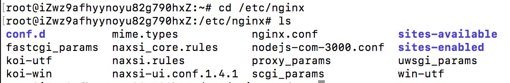
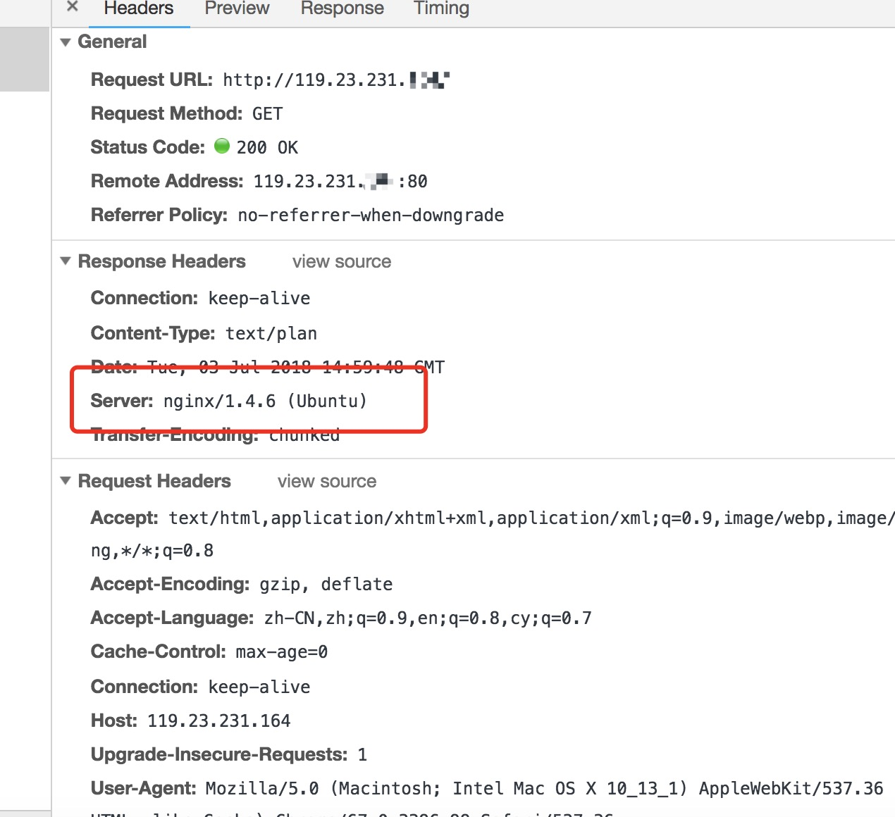
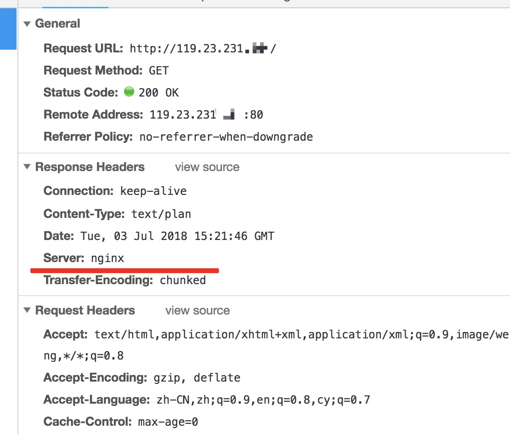

# nginx
nginx作为web服务器一个重要的功能就是反向代理。


#### 安装
服务器终端安装pm2
```
sudo apt-get install nginx
```
可以输入 nginx -v 查看版本

进入 nginx 目录下
```
cd /etc/nginx
```
输入 ls  查看nginx目录的文件




##### 配置
进入 conf.d 文件夹下，新建配置文件， 新建nginx配置的文件，推荐命名方式是 服务器3000端口和node服务。
```
cd conf.d
sudo vi node-com-3000.conf
```


按下 i 进入编写模式（Insertmode模式）, 输入代理的配置

代理是本机3000端口，119.23.231.1XX外网地址
```
upstream nodejs {
 server 127.0.0.1:3000;
}

server {
 listen 80;
 server_name 119.23.231.183;
 location / {
  proxy_set_header X-Real-IP $remote_addr;
  proxy_set_header X-Forwarded-For $proxy_add_x_forwarded_for;
  proxy_set_header Host $http_host;
  proxy_set_header X-Nginx-Proxy true;
  proxy_set_header Connection "";
  proxy_pass http://nodejs;
 }
}
```
输入以上的配置，按esc键，输入 :wq!  保存退出

输入 cd ..  
回到nginx目录的文件
```
cd ..
```

##### 检查配置是否正确，输入以下命令
```
sudo nginx -t
```
显示内容如下，说明配置无误


重新启动nginx服务
```
sudo nginx -s reload
```
如果过程遇到以下：
```
[error]: invalid PID number "" in "/var/run/nginx.pid"
```
1. 查看nginx进程，强制关闭，在重新启动
2. 输入重新加载的配置
```
sudo nginx -c /etc/nginx/nginx.conf
sudo nginx -s reload
```


由于nginx进行转发，由于80端口可以默认不写的，直接打开浏览器

输入你的外网地址        [http://119.23.231.1XX](http://119.23.231.1XX) 无需加3000端口

能查看到


打开调试器，选择 Network



能看到nginx的版本，下面我们要去这个版本

修改 nginx.conf 配置文件
```
sudo vi nginx.conf
```


找到 # server_tokens off;   去掉 #


按i进入inset模式，去掉 #，然后按下esc键， 输入:wq! 保存退出


然后修改了nginx.conf，接下来重启nginx服务
```
sudo nginx -s reload
```

打开浏览器，输入你的外网地址        [http://119.23.231.1XX](http://119.23.231.1XX)

打开调试器，选择 Network，能看到版本信息已经隐藏了

